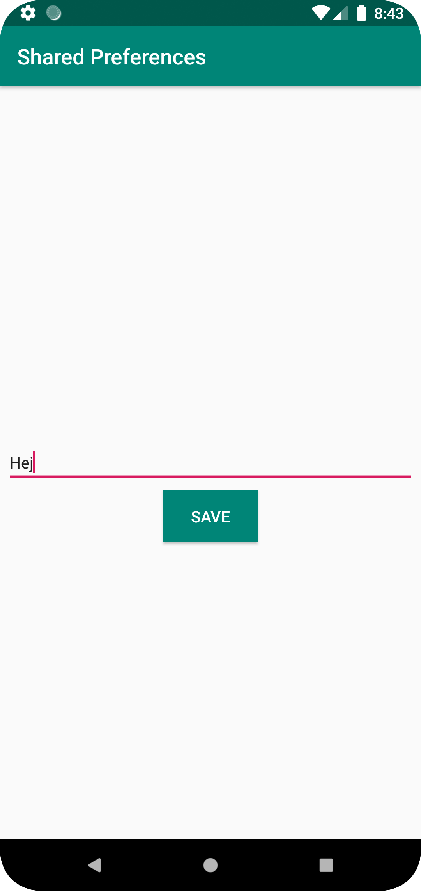
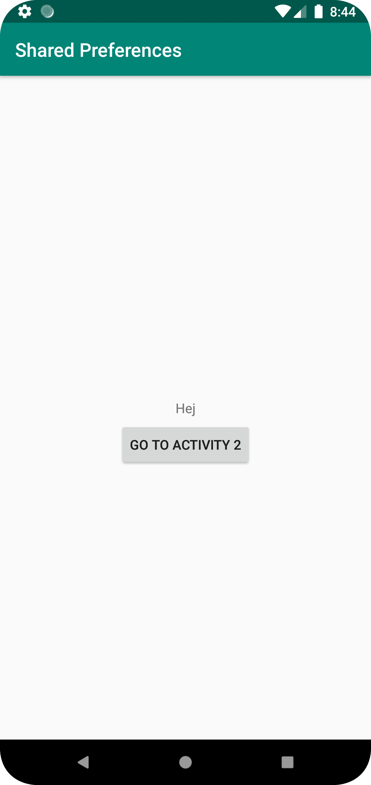

För appens användning krävdes det två aktiviteter då den första skulle ha en knapp som tog användaren till aktivitet 2 samt visa den sparade Stringen.
Den andra aktiviteten skulle få input från användaren genom en EditText vilket skulle kunna sparas som en SharedPreference vilke i sin tur ska kunna synas i aktivitet 1.
Denna String skall även kunna synas efter programmets nedstängning vilket görs genom onResume metoden.
När save kanppen har tryckts på så editas SharedPreference till den ny stringen.


```
public class MainActivity2 extends AppCompatActivity {

    EditText editText;
    Button saveButton;
    SharedPreferences sharedPreferences;
    SharedPreferences.Editor editor;
    TextView textView;

    @Override
    protected void onCreate(Bundle savedInstanceState) {
        super.onCreate(savedInstanceState);
        setContentView(R.layout.activity_main2);

        editText = findViewById(R.id.editText);
        saveButton = findViewById(R.id.saveButton);
        sharedPreferences = getSharedPreferences("SharedPreferences", Context.MODE_PRIVATE);
        editor = sharedPreferences.edit();
        textView = findViewById(R.id.textView);

        saveButton.setOnClickListener(new View.OnClickListener() {
            @Override
            public void onClick(View v) {

                editor = sharedPreferences.edit();
                editor.putString("textInput", editText.getText().toString());
                editor.commit();
                editor.apply();
            }
        });
    }
}
```

```
protected void onResume() {
        super.onResume();
        SharedPreferences sharedPreferences = getApplicationContext().getSharedPreferences("SharedPreferences", Context.MODE_PRIVATE);
        String textInput = sharedPreferences.getString("textInput", "");

        textView = findViewById(R.id.textView);
        textView.setText(textInput);
    }
```





